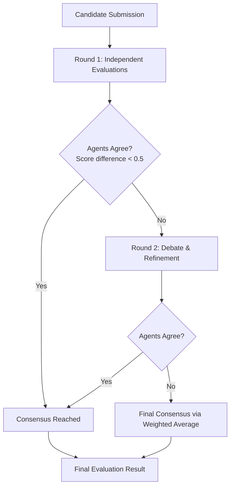

# Multi-Agent Consensus Evaluation System

## Overview

The multi-agent evaluation system uses a **debate-style process** with two AI agents to reduce bias and improve evaluation quality through multiple perspectives and iterative refinement.

## How It Works

### 🎭 The Two Agents

| Agent | Role | Approach | Purpose |
|-------|------|----------|---------|
| **Agent A (Strict)** | Conservative Evaluator | 🔍 Focuses on gaps and weaknesses | Prevents grade inflation and ensures high standards |
| **Agent B (Generous)** | Optimistic Evaluator | ✨ Recognizes potential and strengths | Prevents unfair penalization and recognizes potential |

**Agent A (Strict)** applies rigorous standards and requires strong evidence for higher scores.

**Agent B (Generous)** considers growth opportunities and gives credit for partial demonstrations.

### 🔄 The Evaluation Process



#### Step 1: Independent Evaluation

- Both agents evaluate the same candidate **independently**
- Agent A applies **strict standards** (bias: -0.5 points)
- Agent B applies **generous standards** (bias: +0.5 points)
- Each agent provides:
  - Overall score (1-5 scale)
  - Per-criterion scores
  - Detailed reasoning
  - Evidence from candidate content

#### Step 2: Agreement Check

- If score difference ≤ 0.5 points → **Consensus reached**
- If score difference > 0.5 points → **Proceed to debate**

#### Step 3: Debate Round (if needed)

- **Agent B critiques Agent A's evaluation**
  - Points out areas where strict agent may have been too harsh
  - Highlights overlooked strengths and potential
- **Agent A responds and refines evaluation**
  - Adjusts scores slightly upward (max +0.3 points)
  - Maintains rigorous standards
- **Agent B also refines evaluation**
  - Moves 20% toward strict agent's position
  - Maintains optimistic perspective

#### Step 4: Final Consensus

- **Weighted average** of final scores:
  - Agent A (Strict): **60% weight** 🏋️
  - Agent B (Generous): **40% weight** ⚖️
- Slight preference for strict evaluation ensures quality standards

## 🤖 LLM Integration

### Real AI Evaluation

- Uses **Azure OpenAI** for actual AI reasoning
- Each agent gets a detailed prompt with:
  - Role-specific instructions
  - Candidate content (up to 2000 characters)
  - Rubric criteria and descriptions
  - Evaluation guidelines

### Fallback System

- If LLM fails → Deterministic scoring based on:
  - Content length analysis
  - Keyword detection
  - Agent-specific bias application

## 📊 Output Structure

### Individual Candidate Result

```json
{
  "overall_score": 3.24,
  "criteria_evaluations": [
    {
      "criterion_name": "Technical Skills",
      "score": 3.5,
      "reasoning": "Consensus between strict (3.2) and generous (3.9) evaluations",
      "agent_a_reasoning": "Detailed strict agent analysis...",
      "agent_b_reasoning": "Detailed generous agent analysis..."
    }
  ],
  "consensus_metadata": {
    "rounds_conducted": 2,
    "strict_final_score": 3.1,
    "generous_final_score": 3.4,
    "consensus_method": "weighted_average"
  },
  "agent_detailed_reasoning": {
    "agent_a_strict": {
      "overall_reasoning": "Full LLM response from strict agent...",
      "criteria_reasoning": { "Technical Skills": "Per-criterion analysis..." }
    },
    "agent_b_generous": {
      "overall_reasoning": "Full LLM response from generous agent...",
      "criteria_reasoning": { "Technical Skills": "Per-criterion analysis..." }
    }
  }
}
```

### Batch Evaluation Result

When evaluating multiple candidates on one rubric:

```json
{
  "comparison_summary": {
    "best_candidate": {
      "candidate_id": "candidate_2",
      "score": 3.8,
      "reasoning": "Highest overall performance across criteria"
    },
    "cross_candidate_insights": "Detailed comparison analysis...",
    "recommendation_rationale": "Why this candidate is recommended..."
  },
  "individual_results": [
    // Individual results for each candidate
  ]
}
```

## 🎯 Benefits

### Bias Reduction

- **Multiple perspectives** prevent single-agent bias
- **Conservative + optimistic** views balance each other
- **Debate process** challenges initial assumptions

### Quality Assurance

- **Strict agent** ensures high standards aren't compromised
- **Generous agent** ensures fair recognition of potential
- **Consensus requirement** forces thorough evaluation

### Transparency

- **Full reasoning** from both agents is preserved
- **Debate history** shows how consensus was reached
- **Metadata** provides audit trail of evaluation process

### Consistency

- **Structured process** ensures repeatable evaluations
- **Weighted consensus** provides predictable outcomes
- **Fallback systems** ensure reliability

## 🔧 Configuration

### Consensus Tolerance

- **Default**: 0.5 points difference triggers debate
- **Adjustable** based on evaluation criticality

### Debate Rounds

- **Default**: Maximum 2 rounds
- **Early termination** if consensus reached

### Agent Weights

- **Strict Agent**: 60% (quality focus)
- **Generous Agent**: 40% (fairness focus)
- **Configurable** based on evaluation context

## 🚀 Performance

### Response Times

- **LLM calls**: ~5 seconds per agent
- **Total evaluation**: ~10-15 seconds for consensus
- **Batch processing**: Parallel individual evaluations

### Content Analysis

- **Real AI reasoning**: 300-1000+ character responses
- **Comprehensive analysis**: Per-criterion breakdown
- **Evidence extraction**: From candidate content

---

*This system ensures fair, comprehensive, and high-quality candidate evaluations through the power of multi-agent consensus and AI-driven analysis.*
