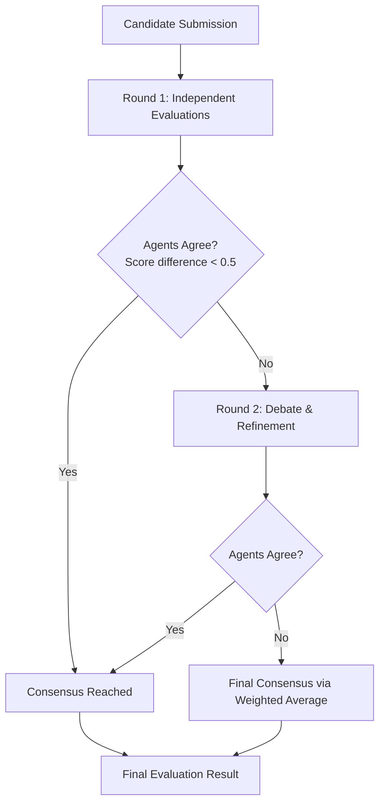

# Multi-Agent Consensus Evaluation System

## Overview

The multi-agent evaluation system uses a **debate-style process** with two AI agents to reduce bias and improve evaluation quality through multiple perspectives and iterative refinement.

## How It Works

### 🎭 The Two Agents

| Agent | Role | Approach | Purpose |
|-------|------|----------|---------|
| **Agent A (Strict)** | Conservative Evaluator | 🔍 Focuses on gaps and weaknesses | Prevents grade inflation and ensures high standards |
| **Agent B (Generous)** | Optimistic Evaluator | ✨ Recognizes potential and strengths | Prevents unfair penalization and recognizes potential |

**Agent A (Strict)** applies rigorous standards and requires strong evidence for higher scores:

- Apply rigorous scoring standards
- Focus on gaps, weaknesses, and areas for improvement  
- Require strong evidence for higher scores
- Be conservative with scoring - only award high scores for exceptional performance
- Look for missing elements and incomplete demonstrations

**Agent B (Generous)** considers growth opportunities and gives credit for partial demonstrations:

- Look for strengths and positive indicators
- Give credit for partial demonstrations and good intentions
- Consider context and circumstances
- Be optimistic about candidate potential
- Recognize effort and improvement opportunities

### 🔄 The Evaluation Process



#### Step 1: Independent Evaluation

- Both agents evaluate the same candidate **independently**
- Agent A applies **strict standards** (bias: -0.5 points)
- Agent B applies **generous standards** (bias: +0.5 points)
- Each agent provides:
  - Overall score (1-5 scale)
  - Per-criterion scores
  - Detailed reasoning
  - Evidence from candidate content

#### Step 2: Agreement Check

- If score difference ≤ 0.5 points → **Consensus reached**
- If score difference > 0.5 points → **Proceed to debate**

#### Step 3: Debate Round (if needed)

- **Agent B critiques Agent A's evaluation**
  - Points out areas where strict agent may have been too harsh
  - Highlights overlooked strengths and potential
- **Agent A responds and refines evaluation**
  - Adjusts scores slightly upward (max +0.3 points)
  - Maintains rigorous standards
- **Agent B also refines evaluation**
  - Moves 20% toward strict agent's position
  - Maintains optimistic perspective

#### Step 4: Final Consensus

- **Weighted average** of final scores:
  - Agent A (Strict): **60% weight** 🏋️
  - Agent B (Generous): **40% weight** ⚖️
- Slight preference for strict evaluation ensures quality standards

## 🤖 LLM Integration

### Standardized Prompting System

- Uses **BATCH_EVALUATION_PROMPT** from centralized prompts module for consistency
- **Role-specific instructions** prepended to base prompt:
  - **Strict Agent**: "Apply rigorous scoring standards, focus on gaps and weaknesses"
  - **Generous Agent**: "Recognize potential and growth, give credit for partial demonstrations"
- **Structured JSON output** format ensures consistent response parsing

### Real AI Evaluation

- Uses **Azure OpenAI** for actual AI reasoning
- Each agent gets a comprehensive prompt with:
  - Role-specific behavioral instructions
  - Standardized evaluation framework
  - Candidate content (up to 2000 characters)
  - Detailed rubric criteria with weights and descriptions
  - Clear scoring guidelines and output format

### Enhanced Response Processing

- **Primary**: Parse structured JSON evaluation responses
- **Fallback**: Extract scores and reasoning from unstructured text
- **Deterministic backup**: Content analysis with agent-specific bias if LLM fails

## 📊 Output Structure

### Individual Candidate Result

```json
{
  "overall_score": 3.24,
  "criteria_evaluations": [
    {
      "criterion_name": "Technical Skills",
      "score": 3.5,
      "reasoning": "Consensus between strict (3.2) and generous (3.9) evaluations",
      "agent_a_reasoning": "Detailed strict agent analysis...",
      "agent_b_reasoning": "Detailed generous agent analysis..."
    }
  ],
  "consensus_metadata": {
    "rounds_conducted": 2,
    "strict_final_score": 3.1,
    "generous_final_score": 3.4,
    "consensus_method": "weighted_average"
  },
  "agent_detailed_reasoning": {
    "agent_a_strict": {
      "overall_reasoning": "Full LLM response from strict agent...",
      "criteria_reasoning": { "Technical Skills": "Per-criterion analysis..." }
    },
    "agent_b_generous": {
      "overall_reasoning": "Full LLM response from generous agent...",
      "criteria_reasoning": { "Technical Skills": "Per-criterion analysis..." }
    }
  }
}
```

### Batch Evaluation Result

When evaluating multiple candidates on one rubric:

```json
{
  "comparison_summary": {
    "best_candidate": {
      "candidate_id": "candidate_2",
      "score": 3.8,
      "reasoning": "Highest overall performance across criteria"
    },
    "cross_candidate_insights": "Detailed comparison analysis...",
    "recommendation_rationale": "Why this candidate is recommended..."
  },
  "individual_results": [
    // Individual results for each candidate
  ]
}
```

## 🎯 Benefits

### Bias Reduction

- **Multiple perspectives** prevent single-agent bias
- **Conservative + optimistic** views balance each other
- **Debate process** challenges initial assumptions

### Quality Assurance

- **Strict agent** ensures high standards aren't compromised through rigorous evaluation criteria
- **Generous agent** ensures fair recognition of potential and partial competencies
- **Standardized prompting** provides consistent evaluation framework across all assessments
- **Consensus requirement** forces thorough evaluation and balances different perspectives

### Transparency

- **Full reasoning** from both agents is preserved
- **Debate history** shows how consensus was reached
- **Metadata** provides audit trail of evaluation process

### Consistency

- **Standardized prompting** with `BATCH_EVALUATION_PROMPT` ensures uniform evaluation approach
- **Role-specific instructions** maintain agent differentiation while using consistent base prompt
- **Structured JSON output** provides predictable response format
- **Weighted consensus** provides predictable outcomes
- **Enhanced fallback systems** ensure reliability with detailed reasoning generation

## 🔧 Configuration

### Prompt Standardization

- **Base Prompt**: Uses centralized `BATCH_EVALUATION_PROMPT` from prompts module
- **Agent Customization**: Role-specific instructions prepended to maintain agent personalities
- **Output Format**: Structured JSON with criterion_name, score, reasoning, and evidence fields
- **Fallback Parsing**: Multiple extraction strategies for robust score retrieval

### Consensus Tolerance

- **Default**: 0.5 points difference triggers debate
- **Adjustable** based on evaluation criticality

### Debate Rounds

- **Default**: Maximum 2 rounds
- **Early termination** if consensus reached

### Agent Weights

- **Strict Agent**: 60% (quality focus)
- **Generous Agent**: 40% (fairness focus)
- **Configurable** based on evaluation context

### Performance

### Response Times

- **LLM calls**: ~3-8 seconds per agent (depending on Azure OpenAI latency)
- **Total consensus evaluation**: ~8-15 seconds including debate rounds
- **Batch processing**: Parallel individual evaluations for multiple candidates

### Content Analysis

- **Structured AI reasoning**: JSON-formatted responses with detailed criterion-by-criterion analysis
- **Comprehensive analysis**: 500-1500+ character responses per agent
- **Evidence extraction**: Specific examples and justifications from candidate content
- **Fallback robustness**: Multiple parsing strategies ensure reliable score extraction

---

*This system ensures fair, comprehensive, and high-quality candidate evaluations through the power of multi-agent consensus and AI-driven analysis.*

## 🔄 Recent Updates

### BATCH_EVALUATION_PROMPT Integration (September 2025)

- **Standardized Prompting**: Migrated from custom prompts to centralized `BATCH_EVALUATION_PROMPT`
- **Enhanced Role Instructions**: Added detailed behavioral guidelines for each agent
- **Structured JSON Output**: Improved response parsing with structured evaluation format
- **Robust Fallbacks**: Multiple parsing strategies ensure reliable score extraction
- **Better LLM Integration**: Enhanced error handling and response processing

This ensures consistency across all evaluation systems while maintaining the unique multi-agent consensus approach.
